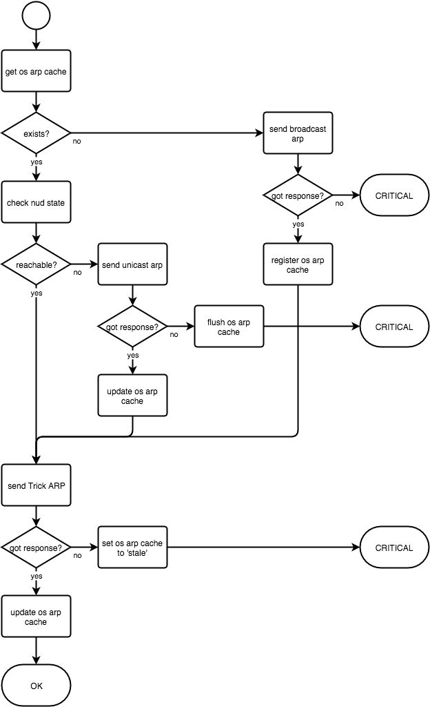

# uufevoker

Simple python script which evokes Unknown Unicast Flooding of the ARP reply from the target host by sending **Trick ARP requests** to maintain forwarding table entries of the target in all L2 switches. Intended to be used as nagios service check script.

## How it works

**Trick ARP** uses the mechanism of ARP to trigger Unknown Unicast Flooding intentionally by spoofing SHA/SPA within ARP request packet.

Usually, ARP is used to resolve the MAC of the target. When a host receives ARP request, it swaps SHA/SPA fields with THA/TPA, set its own MAC address to SHA, then sent out the packet as a reply. So the Destination field in Ethernet layer header of the reply packet *will be the same value as SHA in the request packet*. **Trick ARP** uses this mechanism. Probe host sends an **Trick ARP request** which is spoofing its SHA/SPA with **unused address in that subnet** to let the reply to be flooded across all switches because that spoofed SHA is not in any FDB.

## Prerequisites

- Linux / iproute
    - depends on `ip neigh` command
- Python
- Scapy
- netaddr (python package)
- netifaces (python package)

Tested with following environments:

- CentOS 6.4
    - kernel-2.6.32-358.123.2.openstack.el6.x86_64
    - iproute-2.6.32-130.el6ost.netns.2.x86_64
    - Python 2.6.6 (base)
    - Scapy 2.0.0 (epel)
    - python-netaddr-0.7.5-4.el6.noarch (base)
    - python-netifaces-0.5-1.el6.x86_64 (epel)
    - Nagios 3.5.1 (epel)

## Usage

You need root privilege.

```bash
sudo /path/to/uufevoker/uufevoker.py -i eth0 -d 192.0.2.1
```

### Options

- -i/--interface *dev*  
**(Required)** Interface from which all packets are sent out and received. This interface must have one IP address assigned and be set promiscuous mode on. If the specified interface is virtual device e.g. VLAN sub interface, then parent device must also be set promiscuous mode on.

- -d/--pdst *target_ip*  
**(Required)** Target IP address. Trick ARP requests are sent to this host.

- -S/--hwsrc *mac*  
MAC address set to *Source Hardware Address* field of Trick ARP request packet. The target will send ARP reply to this MAC. **Specify any address which is not actually used in the network** to make the reply floods among all switches.  
Default: 02:00:00:be:ee:ef

- -s/--psrc *ip*  
IP address set to *Source Protocol Address* field of Trick ARP request packet. **It is highly recommended to specify any unused address from the same prefix as the target IP.** If you specify the same address assigned to the interface given with -i option, it may trigger Duplicate Address Detection and might break a normal communication. Also note that the default will use 0.0.0.0 but some routers may not respond to such ARP requests.  
Default: 0.0.0.0

- -t/--timeout *timeout*  
Timeout in seconds waiting arp replies after every request made.  
Default: 3 (seconds)

### Use with nagios

As mentioned previously, this script is intended to be used as nagios service check script. Within nagios, exit code of check scripts reflects the state of that service. For example, 0 means OK, 2 means CRITICAL, etc. uufevoker.py exits with a certain code based on the flow shown below.



#### Setup nagios

If you are running nagios as non-pirivileged user e.g. nagios or nobody, you need to add sudo entry first so that the user can invoke it without any password.

**BEWARE (mostly for CentOS users): You must disable requiretty option as well.**

```
nagios ALL=(ALL) NOPASSWD: /path/to/uufevoker/uufevoker.py

#Defaults requiretty
# comment this line out
```

Next define a nagios command,

```
define command {
  command_name    uufevoker
  command_line    /usr/bin/sudo /path/to/uufevoker/uufevoker.py -i eth0 -d $HOSTADDRESS$ -S 00:50:56:be:ee:ef -s 192.0.2.2
}
```

Then use it:

```
define service {
  use                     generic-service
  host_name               TARGET_HOST
  service_description     UUFEVOKER
  check_command           uufevoker
}
```

### logging

TBD
